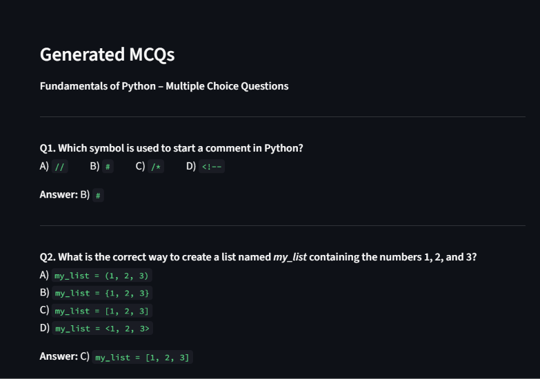

# 📝 AI MCQ Generator

An AI-powered Multiple Choice Question (MCQ) Generator built using Python, Streamlit, and Hugging Face.

The application generates MCQs automatically from any topic entered by the user. It is useful for students, teachers, and self-learning purposes.
**Live Link:**
https://mcq-generator-ntriemmuybem8jzsvl4wqg.streamlit.app/

---

## 🚀 Features

- Generate MCQs using AI
- Enter any topic
- Select the number of questions
- Four options for each question
- Displays correct answers
- Simple and user-friendly interface
- Powered by Large Language Models (LLMs)

---

## 🛠️ Technologies Used

- Python
- Streamlit
- Hugging Face
- GPT-OSS Model

---

## 📂 Project Structure

```text
MCQ-Generator/
│
├── app.py
├── requirements.txt
├── README.md
│
└── .streamlit/
    └── secrets.toml
```

---

## ⚙️ Installation

### 1. Clone the Repository

```bash
git clone https://github.com/your-username/MCQ-Generator.git
```

### 2. Navigate to the Project Folder

```bash
cd MCQ-Generator
```

### 3. Install Dependencies

```bash
pip install -r requirements.txt
```

---

## 🔑 Configure Hugging Face Token

Create a folder named:

```text
.streamlit
```

Inside the folder create:

```text
secrets.toml
```

Add your Hugging Face Access Token:

```toml
HF_TOKEN = "your_huggingface_token"
```

Do not upload your token to GitHub.

---

## ▶️ Run the Application

```bash
streamlit run app.py
```

The application will open automatically in your browser.

---

## 🔄 Workflow

1. User enters a topic.
2. User selects the number of questions.
3. Prompt is sent to the Hugging Face model.
4. AI generates MCQs.
5. Questions and answers are displayed on the screen.

---

## 📖 Example Input

Topic:

```text
Python Programming
```

Number of Questions:

```text
5
```

---

## 📖 Example Output

```text
Q1. Which keyword is used to define a function in Python?

A) function
B) define
C) def
D) func

Answer: C) def
```

---

## 🎯 Use Cases

- Student exam preparation
- Practice quizzes
- Classroom activities
- Technical interview preparation
- Self-learning
- Educational content generation

---

## 🔮 Future Improvements

- Difficulty Levels
- PDF Download
- Quiz Scoring
- Timer-Based Quiz
- Answer Evaluation
- Multiple Subject Support

---

## 📸 Screenshots

### Home Page


### Generated MCQs



---

## 👩‍💻 Author

**Hemalatha K**

Student | Python Developer | AI & Data Science Enthusiast

---

## ⭐ Support

If you like this project, give it a star on GitHub.
